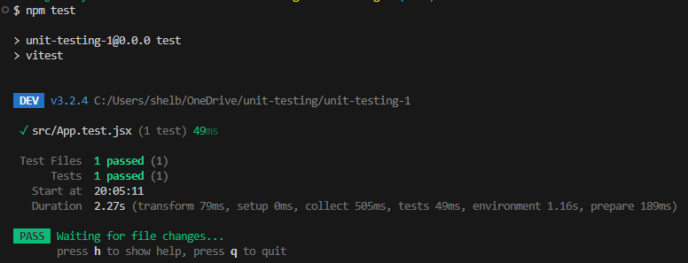

# Unit Testing Assignment 1

This assignment introduces us to unit testing with Vitest by walking us through the setup and installations

## Steps Taken

- Create a new React project with `npm create vite@latest`
- Install dependencies
  - `npm install --save-dev vitest @testing-library/react @testing-library/jest-dom jsdom
`
- Configure Vitest by updating the existing Vite configuration file:

``` JavaScript
test: {
    environment: 'jsdom',
    globals: true
}
```

- Update scripts in `package.json`:

``` JSON
"scripts": {
  "dev": "vite",
  "build": "vite build",
  "preview": "vite preview",
  "test": "vitest"
}
```

- Create a test file within the `src` file
  - `src/App.test.jsx`
- Write the first test using the example code from the assignment:

``` jsx
import { render, screen } from '@testing-library/react';
import '@testing-library/jest-dom';
import App from './App';

test('renders hello message', () => {
  render(<App />);
  expect(screen.getByText(/vite \+ react/i)).toBeInTheDocument();
});
```

- Run the tests with `npm test` in the terminal
- Testing results will display clearly in the terminal:

